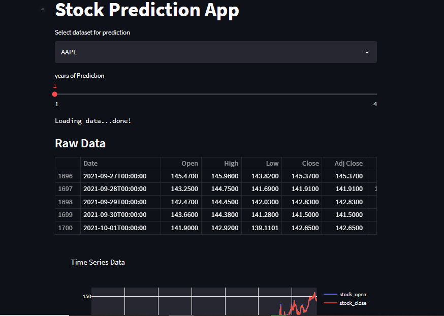

# Stock-Prediction-App

Created an interactive dashboard using our python script which fetches data from yfinance API and forecast 
using fbprophet which then showcased in a real-time interactive dashboard. 

Usage: install the required libraries, activate your venv. 
In terminal run the following command: streamlit run main.py 

